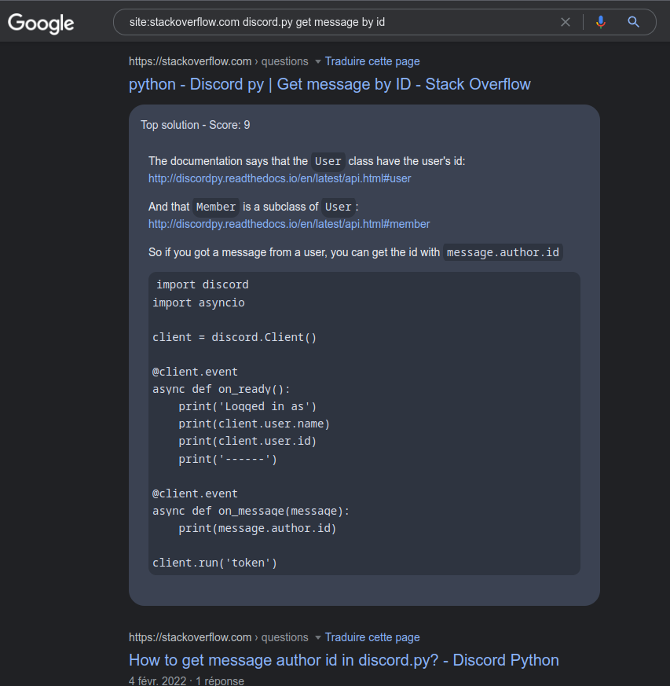

 

# StackOverflow Snippets

A browser extension that adds code snippets from StackOverflow to search results

## Installation

**CHROME**
* Download the repository
* Go to `chrome://extensions/`
* Enable the `Developer Mode`
* Click on `Load unpacked`
* Select the repository folder

**FIREFOX** - [**Download from the Mozilla Add-Ons**](https://addons.mozilla.org/firefox/addon/stackoverflow-snippets/)

Or with the developer mode
* Download the repository
* Go to `about:debugging#/runtime/this-firefox`
* Click on `Loading a temporary add-on`
* Select the repository `content.js` file

## Preview

## Discord

Join the Discord server !

## Contributing

Pull requests are welcome. For major changes, please open an issue first to discuss what you would like to change.

Please make sure to update tests as appropriate.

## License

This project is under [GPLv3](LICENSE).

## Source

This project is derived from [codesearch](https://github.com/busybox11/codesearch)
